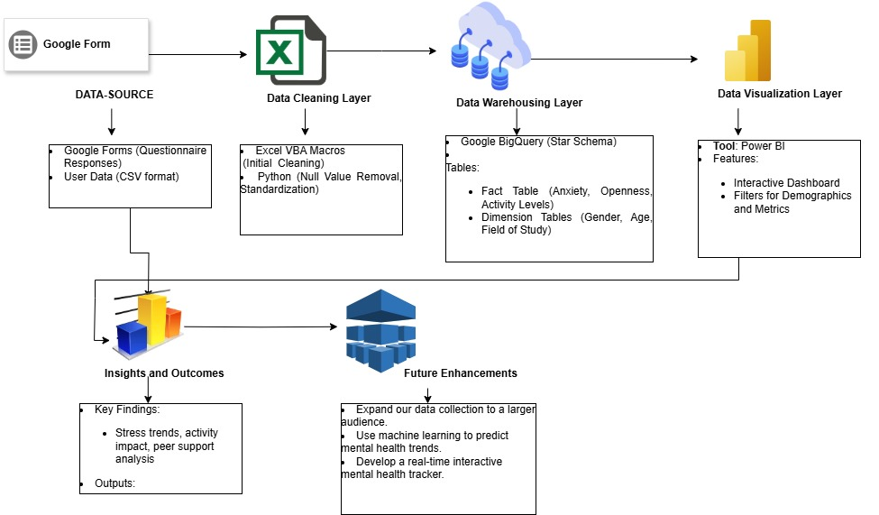
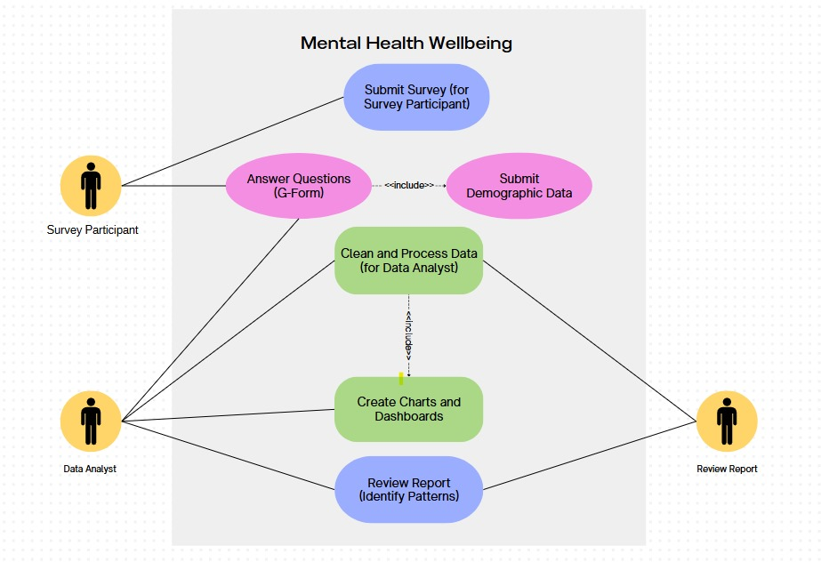
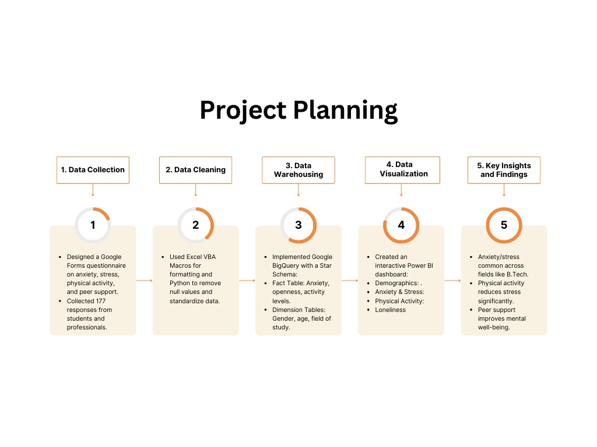

# Mental Health and Student Wellbeing

## 🌟 Project Overview
This project delves into mental health patterns among students aged 18–32 using survey data. It provides actionable insights through data visualization and warehousing techniques to foster awareness, reduce stigma, and recommend strategies for enhanced mental well-being.

## 📊 Key Features
- **Comprehensive Survey Analysis**: Unveils insights into anxiety, coping mechanisms, and emotional openness among students.
- **Interactive Dashboards**: Visual storytelling with Power BI for better understanding of mental health trends.
- **System Architecture**: Clear visualization of the system's design, including workflows and use cases.

## ⚙️ Technologies Used
- **Programming Languages**: Python, VBA (Excel Macros)
- **Data Visualization**: Power BI
- **Supporting Tools**: Microsoft Excel, Google Forms

## 🗂 Project Structure
```plaintext
MentalHealthWellbeing/
├── README.md                   # Project description
├── MentalHealth_Cleaned.csv     # Cleaned dataset
├── MentalHealth_Survey_Raw.xlsx # Raw survey data
├── MentalHealth_Dashboard.pbix  # Power BI dashboard file
├── dashboard.pdf               # PDF version of the dashboard
├── Project_planing.jpg         # Project planning image
├── system_architecture_design.jpg  # System architecture design
├── use_case_diagram.jpg        # Use case diagram image
```

---

## 📐 Diagrams

### System Architecture
Below is the visual representation of the system's architecture, highlighting key components and workflows:



---

### Use Case Diagram
The use case diagram outlines the system's primary interactions and functionalities:



---

### Project Planning
Here’s a high-level overview of the project timeline and milestones:



---

## How to Use This Repository

### 1. **Prerequisites**
   - Install **Microsoft Excel** and **Power BI Desktop**.
   - Set up a **Google BigQuery project** with the necessary permissions.

### 2. **Run ETL Operations**
   - Open the `MentalHealth_Survey_Raw.xlsx` file in Excel.
   - Use the `RenameColumns.vba` script to standardize column names.
   - Save the cleaned data as `MentalHealth_Cleaned.csv`.

### 3. **Data Loading into BigQuery**
   - Use the `star_schema_creation.sql` script to define the schema in BigQuery.
   - Import the `MentalHealth_Cleaned.csv` file into the appropriate fact and dimension tables.

### 4. **Data Visualization in Power BI**
   - Launch the `MentalHealthDashboard.pbix` file in **Power BI Desktop**.
   - Connect the dashboard to your BigQuery project.
   - Interact with the dashboard to uncover meaningful insights.

---

## Key Results and Insights
1. **Higher Anxiety Levels in Younger Students**: Students aged 18–25, particularly in high-stress academic fields, reported elevated anxiety levels.
2. **Positive Impact of Physical Activity and Family Support**: Regular exercise and strong family support were strongly associated with better mental health.
3. **Workload and Stress Correlation**: Heavy academic workloads were a major driver of anxiety and reduced mental well-being.
4. **The Role of Community and Peer Networks**: Students with access to supportive peer networks and communities reported lower stress levels and better overall mental health.

---

## Future Enhancements
- Broadening the dataset to cover more diverse demographics, including variations in age, geography, and academic disciplines.
- Implementing advanced machine learning techniques to predict mental health trends and patterns.
- Automating data pipelines for real-time integration and analysis of incoming survey responses.

---

## Acknowledgments
- **Survey Participants**: Grateful appreciation to everyone who contributed to the survey for their valuable input.
- **Technologies and Platforms**: Google Forms, Microsoft Excel, VBA, Google BigQuery, Power BI for enabling this project.

---

## License
This project is distributed under the MIT License. For details, refer to the `LICENSE` file.
```

